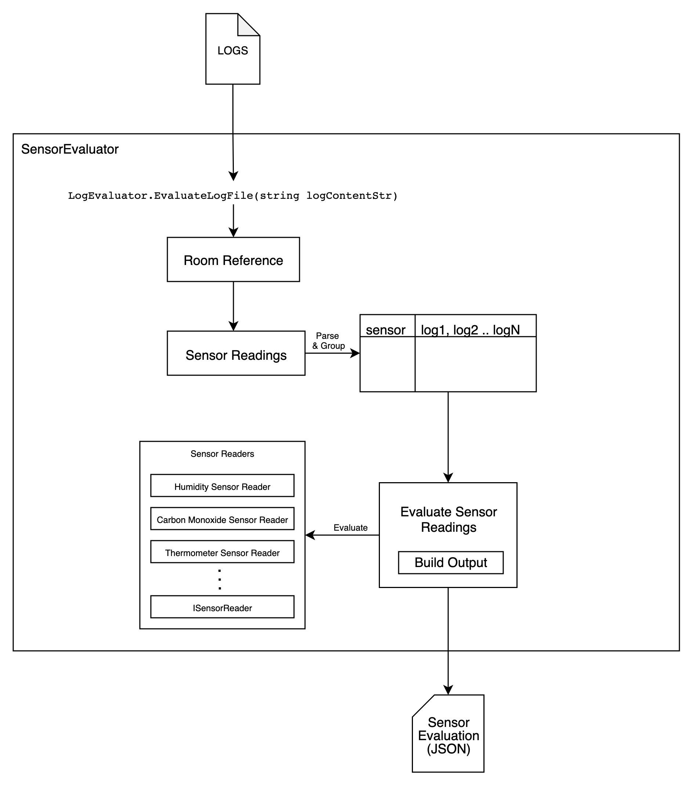

# SensorEvaluator

## What does SensorEvaluator do?
Sensor Evaluator is a .NET library that parses and evalutes device classification.
## How does it do it?
1. Accepts logs (`string[]`) 
2. Traverse the logs, grouping readings by device name.
3. Evaluate the classification depending on the device type.
4. Output JSON in the following format:
```json
// Keys are device names & Values are the classficiation.
{
"temp-1": "precise",
"temp-2": "ultra precise",
"hum-1": "keep",
"hum-2": "discard",
"mon-1": "keep",
"mon-2": "discard"
}
```



## How do I use it?
After adding the SensorEvaluator library as a reference to your .NET project, you can either use the fully qualified namespace like so

```c#
namespace Project
{
    public class App
    {
        var logs = @"
            reference 70.0 45.0 6
            thermometer temp-1
            2007-04-05T22:00 72.4
            2007-04-05T22:04 71.2
            2007-04-05T22:05 71.4
            2007-04-05T22:06 69.2
            2007-04-05T22:11 67.5
            2007-04-05T22:12 69.4
        ";

        var output = SensorEvaluator.LogEvaluator.EvaluateLogFile(logs);
    }
}
```

or add the `using` statement and use it like so:
```c#
using SensorEvaluator;

namespace Project
{
    public class App
    {
        var logs = @"
            reference 70.0 45.0 6
            thermometer temp-1
            2007-04-05T22:00 72.4
            2007-04-05T22:04 71.2
            2007-04-05T22:05 71.4
            2007-04-05T22:06 69.2
            2007-04-05T22:11 67.5
            2007-04-05T22:12 69.4
        ";

        var output = LogEvaluator.EvaluateLogFile(logs);
    }
}
```

## What version of .NET is supported?
The recommendation is that consuming applications/libraries use .NET Core 3.1.
<br><br>
## How do I add additional Sensor Readings?
1. Add Implementation of `ISensorReader` to the `lib/SensorReaders` dir. 
2. Add the new device `sensorType` and the implementation from `1.` to `lib/SensorReaders/SensorReaderBuilder.cs`.
3. Add Property and Property definition (found within `GetRoomReference` method) to `lib/RoomReference.cs`.
4. Add unit tests to `tests/SensorReaderTests` dir.
5. Add test cases to `tests/AllSensorReadersTests.cs`. This serves as an e2e test.
